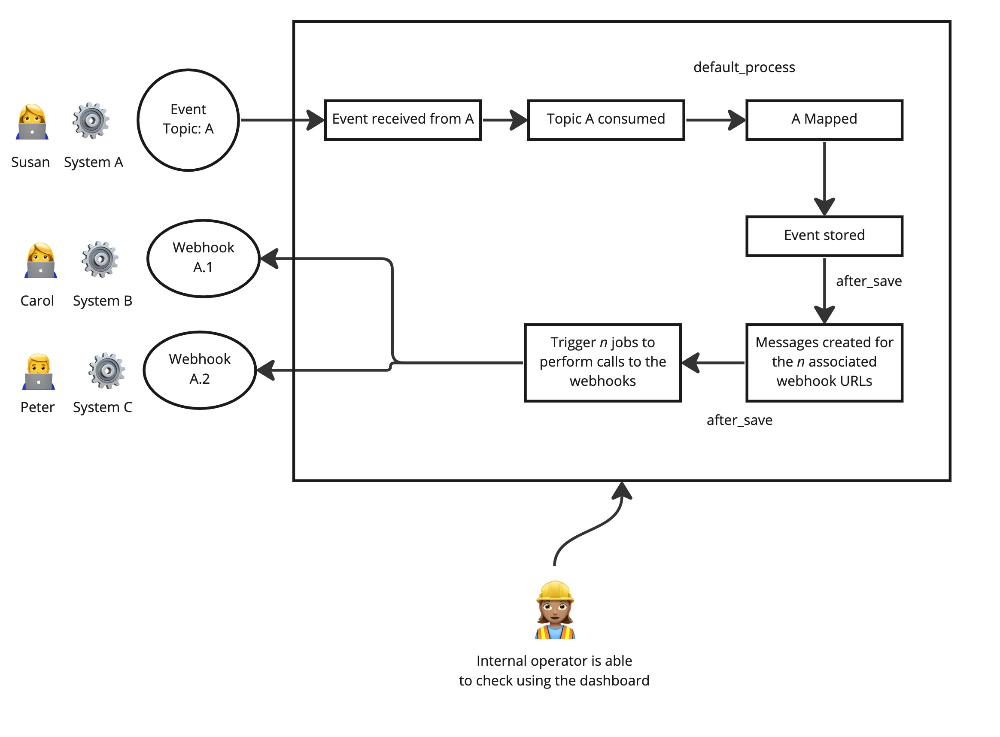

# README

This microservice receives events from Kafka, map them and send them as webhooks via API REST.

## Event broker configuration

This project gives you the posibility of producing and consuming messages.

Locally, you can use Docker to mount Kafka & Zookeeper on localhost:9092.

Remotely, the project is set to support Heroku Kafka. If you have your cluster in other location, you can modify the configuration on ``lib/kafka_config.rb``.

### Quick setup

#### Consumers (registering topics)

1. Set GROUP_ID on ``lib/kafka_config.rb``.
2. Register TOPICS on `config/initializers/basic_consumer.rb`.
3. Create consumer classes for each topic on `app/consumers/TOPIC_consumer.rb` and include a method consume able to receive a message.

#### Default processing

You are able to create custom consumers for each topic. But, in mostly cases, you can use the default flow.

To do this, you need to:

1. Create the consumer and calling, in your method `consume`, to `process_default(message)`method.
2. Create a mapper following the naming convention. This class should return a hash with:
  - user_id: identifier to track the user related to the event.
	- payload: the message processed in the way you expect to receive the webhook.

#### Producing messages

You can easily send a message as follows:
``
kafka = Kafka.new('localhost:9092')
kafka.deliver_message("Hello, world!", topic: "#{ENV['KAFKA_PREFIX']}topic_name")
``

Also, you are able to debug messages trough console using:

`KafkaConfig.test_consumer 'topic_name'`

This will subscribe your console session to a logger and the messages that you send to `topic_name` will be shown live.

#### Connecting to the dashboard

You need to set ADMIN_USERNAME and ADMIN_PASSWORD env variables and, then, you can access to host_url/admin to follow up the stored data.

#### Configuring webhooks

In the admin, go to the Webhook section, and create the necessary webhooks for each topic you suscribed previously.
